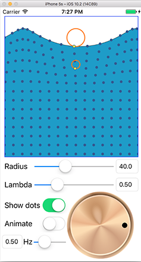

##TrochoidDemo

This project uses "trochoid" curves to simulate the motion of waves in water.

It uses Catmull-Rom splines to smooth the points of the trochoid curves.

It also includes a custom one finger gesture recognizer to let the user spin a "knob" to scrub the wave motion back and forth.

The one finger gesture recognizer is defined in the file `OneFingerGestureRecognizer.swift`

A "trochoid" is a curve that is created when you roll a wheel along a flat surface and that wheel has a pen on its hub that traces a curve along a flat surface:

[Trochoids article on Wikipedia](https://en.wikipedia.org/wiki/Trochoid)

If you increase the radius of the circle, you get larger waves.

If you move the "pen" on the wheel towards the center of the wheel, the shape becomes a "curtate trochoid". (bottom illustration in the image below.)

If you move the "pen" so that it extends past the radius of the wheel (imagine it's attached to a stick) then the shape becomes a "prolate trochoid". (top curve in the illustration below)

The "lambda" slider in the application lets you control the type of trochoid curve that's generated. A value of 1 creates a "Cycloid" (the middle curve above.) A lambda value < 1 cretaes a curtate trochoid, and lambda > 1 creates a prolate trochoid, which loops back on itself.

##Using the Application:

When you first launch the application it begins animating with default settings of radius = 40 points, Lambda = 0.5, and an animation speed of 1/2 wave per second (2 seconds per wave.

If you spin the dial on the lower right, you can "scrub" the wave animation forwards or backwards. If you drag the radius, Lambda, or "Hz" (waves/second) sliders, you can change those settings at will. You can also tap in one of the input boxes and enter a numeric value for any of those settings.

If you double-tap on the Lambda slider it resets to its' default setting of 0.5. Triple-tapping on the Lambda slider sets the Lambda value to 1.0

Double-tapping on the "Hz" (animation speed) slider sets it to it's default setting of 1/2 waves/second.

Double-tapping on the "knob" control pauses the animation and resets the rotation angle to zero (the zero point is off-screen on the left.)

##Catmull-Rom splines

The file `SmoothCGPointsArray.swift` has several methods that let you use Camull-Rom splines to smooth curves. This application uses the method `smoothPointsInArray`, which takes an array of CGPoints, and an optional "granularity" setting, and returns an output array of CGPoints where intermidiate points have been added to smooth the curve. It's then trivial to either convert the resulting array of points to a UIBezierPath/CGPath, or plot it directly using Core Graphics. By default the `smoothPointsInArray(_:granularity:adjustGranularity:)` function uses a `granularity` setting of 4, which adds 4 extra points between each control point. It also uses a default value of `adjustGranularity=true`, which causes the method to increase the number of intermidiate points when the 2 source points are far away, and decrease the number of smoothing points that are added when 2 source points are close together.

##One finger UIRotationGestureRecognizer:

The file `OneFingerGestureRecognizer.swift` contains a `UIGestureRecognizer` that is much like a standard `UIRotationGestureRecognizer`, except that it allows the user to provide a rotation by pressing with their finger and rotating like they are turning a turntable. This one-finger rotation gesture works well for knob controls like the one used in this application.